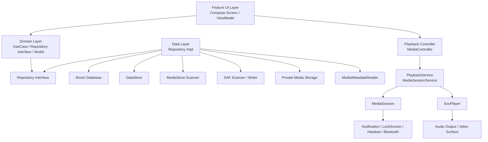
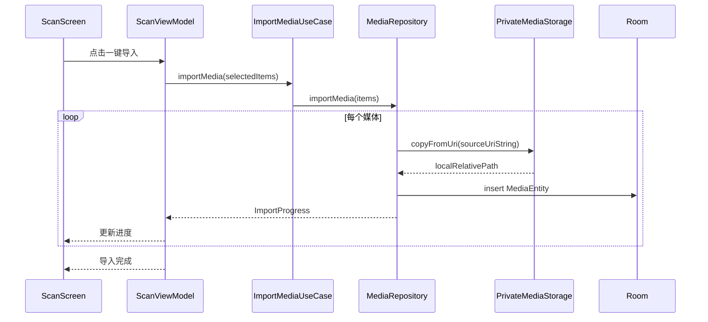
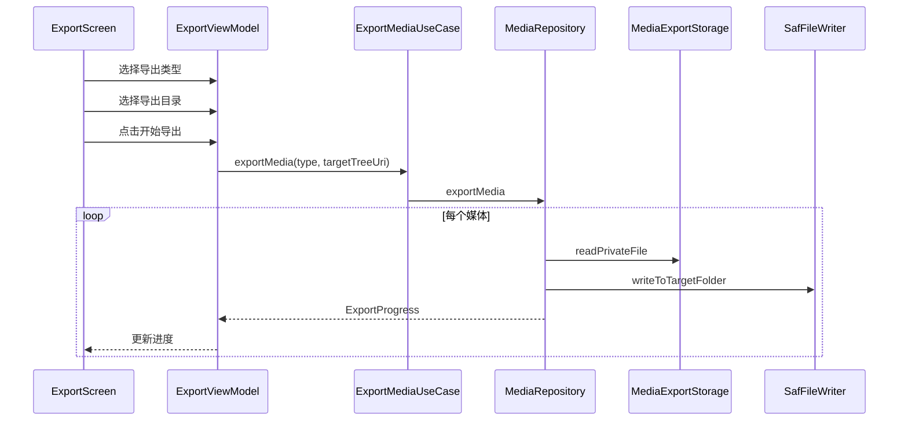
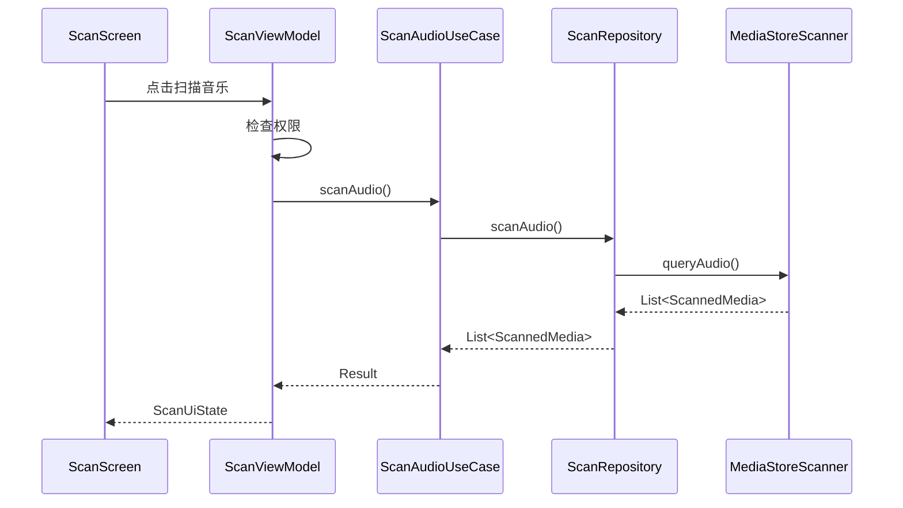
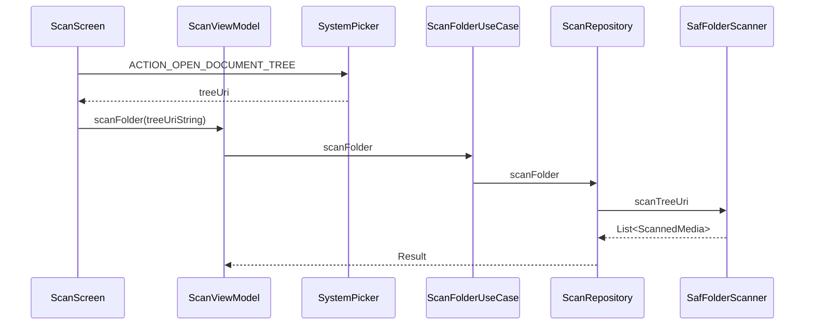
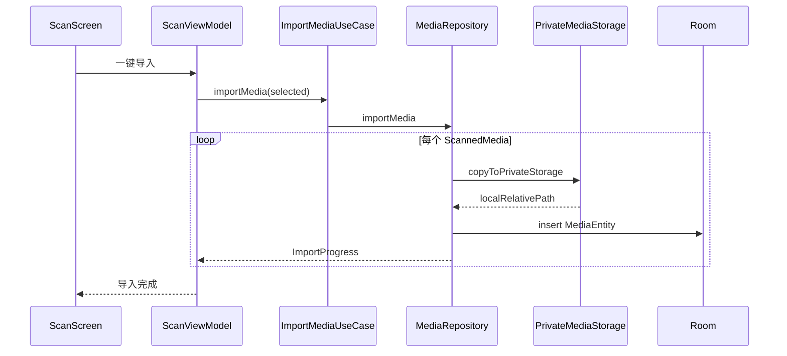
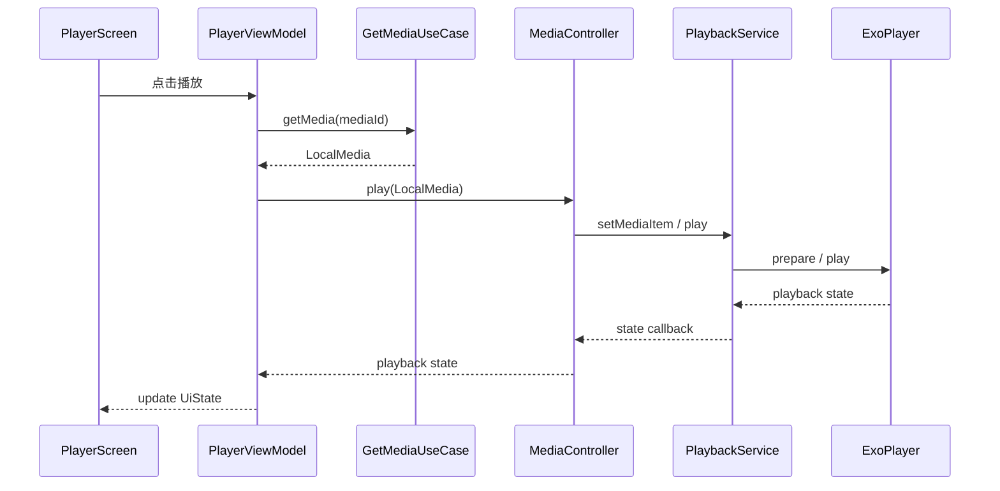

# 《我的媒体》本地音视频播放器实施文档

# 一、项目定位

## 1.1 项目名称

暂定名称：

```text
我的媒体 / MyMedia
```

## 1.2 项目目标

本项目是一个本地音视频播放器 Demo，主要用于学习 Android 媒体开发、现代存储模型、Jetpack Media3、MVVM 与 Clean Architecture。

核心功能：

1. 扫描手机系统媒体库中的音乐和视频。
2. 支持用户通过 SAF 主动选择目录进行补充扫描。
3. 扫描结果可以一键导入 App 私有目录。
4. 导入后的文件存放在 App 自己的 `Android/data/包名/files/media/` 下。
5. 导入目录中创建 `.nomedia`，避免被系统相册或第三方媒体 App 扫描。
6. App 内可以播放音乐。
7. App 内可以播放视频。
8. 支持播放、暂停、上一首、下一首、快进、快退、拖动进度条、倍速。
9. 支持后台音乐播放、通知栏控制、锁屏控制、耳机按键控制。
10. 支持下次进入 App 恢复上次播放页面、播放媒体、播放进度。
11. 支持一键导出 App 内的全部音乐或视频。
12. 支持播放列表、最近播放、收藏、搜索、排序等扩展功能。
13. 用 MVVM + Clean Architecture 组织项目。

## 1.3 项目边界

这个项目不是为了绕过第三方 App 的私有存储限制。

例如：

```text
/storage/emulated/0/Android/data/com.netease.cloudmusic/
```

这类第三方 App 私有目录，在 Android 11+ 上普通 App 通常不能直接访问，也不应该把它作为主扫描目标。

正确思路是：

```text
系统媒体库可见的音视频 -> 使用 MediaStore 扫描
用户主动授权的文件夹 -> 使用 SAF 扫描
App 自己导入后的文件 -> 使用 App 私有目录管理
```

---

# 二、核心技术与应用场景映射表

| 技术 / 组件 | 使用场景 | 具体作用 |
|---|---|---|
| Kotlin | 全项目开发语言 | 配合协程、Flow、DataStore、Compose 使用更自然 |
| Jetpack Compose Material3 | UI 层 | 构建首页、扫描页、媒体库、播放页、设置页 |
| MVVM | UI 架构 | `Screen -> ViewModel -> UiState`，降低 UI 和业务耦合 |
| Clean Architecture | 项目分层 | 区分 `feature / domain / data / playback` 职责 |
| MediaStore | 系统媒体扫描 | 查询系统已经收录的音频、视频 |
| Storage Access Framework | 用户授权目录扫描与导出 | 让用户选择文件夹，App 获得该目录访问权限 |
| App-specific External Storage | 导入后的私有媒体存储 | 存放在 `Android/data/包名/files/media/` |
| `.nomedia` | 避免系统媒体库扫描 | 防止导入后的媒体出现在相册或第三方播放器中 |
| Room | 本地媒体库数据库 | 保存导入媒体、播放进度、播放次数、播放列表 |
| DataStore | 轻量配置 | 保存播放模式、排序方式、上次页面、当前播放会话 |
| Jetpack Media3 ExoPlayer | 播放核心 | 统一播放本地音频和视频 |
| Media3 MediaSession | 系统媒体会话 | 对接通知栏、锁屏、耳机、蓝牙、车机媒体控制 |
| MediaSessionService | 后台播放服务 | 持有 `ExoPlayer + MediaSession`，让播放生命周期独立于 UI |
| MediaController | UI 与 Service 通信 | 页面不直接持有 ExoPlayer，而是通过 Controller 控制播放 |
| PlayerView | 视频渲染 | 视频播放页承载视频画面 |
| Coroutines | 异步任务 | 扫描、导入、导出、数据库读写 |
| Flow / StateFlow | 状态流 | 扫描进度、导入进度、播放状态、媒体库列表 |
| Hilt | 依赖注入 | 提供 Repository、UseCase、Room、DataStore、Playback 相关依赖 |
| WorkManager | 后台导入导出 | 大文件批量复制、导出任务可放到后台执行 |
| MediaMetadataRetriever | 元数据读取 | 读取本地音频/视频时长、封面、宽高等信息 |
| AudioManager | 视频手势音量控制 | 右侧上下滑动调整音量 |
| Window Attributes | 视频手势亮度控制 | 左侧上下滑动调整屏幕亮度 |

---

# 三、总体架构设计

## 3.1 总体架构图



## 3.2 依赖方向

正确依赖方向：

```text
feature -> domain
feature -> playback/controller
feature -> core/ui

playback -> domain
playback -> core

data -> domain
data -> core

worker -> domain
worker -> data

app -> feature
app -> data
app -> playback
app -> core
```

禁止出现的反向依赖：

```text
domain -> data        错误
domain -> app         错误
domain -> playback    错误
data -> feature       错误
playback -> feature   错误
```

## 3.3 分层职责

### feature 层

职责：

1. 页面展示。
2. 用户交互。
3. ViewModel 状态管理。
4. 调用 UseCase。
5. 通过 `PlaybackController` 控制播放。

不应该做：

1. 不直接访问 Room。
2. 不直接访问 MediaStore。
3. 不直接访问 ContentResolver。
4. 不直接进行文件复制。
5. 不直接创建 ExoPlayer。

### domain 层

职责：

1. 定义核心业务模型。
2. 定义 Repository 接口。
3. 定义 UseCase。
4. 承载业务规则。

不应该出现：

```kotlin
Context
Uri
File
DocumentFile
ContentResolver
ExoPlayer
MediaItem
Room Entity
Dao
```

### data 层

职责：

1. 实现 Repository。
2. 查询 MediaStore。
3. 处理 SAF。
4. 读写 Room。
5. 读写 DataStore。
6. 导入、导出文件。
7. 读取媒体元数据。
8. 处理文件名、路径、`.nomedia`。

### playback 层

职责：

1. 创建并管理 ExoPlayer。
2. 创建并管理 MediaSession。
3. 提供 MediaController 连接。
4. 对接通知栏、锁屏、耳机、蓝牙控制。
5. 将 Domain 媒体模型转换成 Media3 `MediaItem`。
6. 提供播放状态观察。
7. 处理视频手势控制。

### worker 层

职责：

1. 大文件导入任务。
2. 大文件导出任务。
3. 长时间后台复制。
4. 任务进度回传。

第一版可以先不用 WorkManager，等导入导出基本流程跑通后再加。

---

# 四、推荐项目目录结构

## 4.1 第一版推荐：单模块清晰分包

第一版不建议上来就拆太多 Gradle 模块。  
原因是你这个项目主要是学习媒体框架、存储权限、Media3 播放和架构，过早拆模块会增加 Gradle、Hilt、KSP、Room Schema、依赖暴露等复杂度。

推荐先使用：

```text
app/
└── src/main/java/com/example/mymedia/
    ├── MyMediaApp.kt
    ├── MainActivity.kt
    │
    ├── di/
    │   ├── DatabaseModule.kt
    │   ├── DataStoreModule.kt
    │   ├── RepositoryModule.kt
    │   ├── PlaybackModule.kt
    │   ├── StorageModule.kt
    │   └── WorkerModule.kt
    │
    ├── core/
    │   ├── common/
    │   │   ├── AppResult.kt
    │   │   ├── AppError.kt
    │   │   └── DispatchersProvider.kt
    │   │
    │   ├── permission/
    │   │   ├── MediaPermissionManager.kt
    │   │   └── PermissionState.kt
    │   │
    │   ├── storage/
    │   │   ├── AppStorageDirs.kt
    │   │   ├── NoMediaFileCreator.kt
    │   │   └── FileNameGenerator.kt
    │   │
    │   └── ui/
    │       ├── BaseUiState.kt
    │       ├── UiEvent.kt
    │       └── components/
    │
    ├── domain/
    │   ├── model/
    │   │   ├── LocalMedia.kt
    │   │   ├── ScannedMedia.kt
    │   │   ├── MediaType.kt
    │   │   ├── Playlist.kt
    │   │   ├── PlaybackSession.kt
    │   │   ├── PlaybackProgress.kt
    │   │   ├── ImportProgress.kt
    │   │   └── ExportProgress.kt
    │   │
    │   ├── repository/
    │   │   ├── MediaRepository.kt
    │   │   ├── ScanRepository.kt
    │   │   ├── PlaybackRepository.kt
    │   │   └── SettingsRepository.kt
    │   │
    │   └── usecase/
    │       ├── scan/
    │       │   ├── ScanAudioUseCase.kt
    │       │   ├── ScanVideoUseCase.kt
    │       │   └── ScanFolderUseCase.kt
    │       │
    │       ├── importmedia/
    │       │   └── ImportMediaUseCase.kt
    │       │
    │       ├── exportmedia/
    │       │   └── ExportMediaUseCase.kt
    │       │
    │       ├── library/
    │       │   ├── GetAudioLibraryUseCase.kt
    │       │   ├── GetVideoLibraryUseCase.kt
    │       │   ├── DeleteMediaUseCase.kt
    │       │   └── SearchMediaUseCase.kt
    │       │
    │       ├── playback/
    │       │   ├── SavePlaybackProgressUseCase.kt
    │       │   ├── GetPlaybackSessionUseCase.kt
    │       │   ├── SavePlaybackSessionUseCase.kt
    │       │   └── GetResumeMediaUseCase.kt
    │       │
    │       └── playlist/
    │           ├── CreatePlaylistUseCase.kt
    │           ├── AddMediaToPlaylistUseCase.kt
    │           └── RemoveMediaFromPlaylistUseCase.kt
    │
    ├── data/
    │   ├── local/
    │   │   ├── db/
    │   │   │   ├── AppDatabase.kt
    │   │   │   ├── dao/
    │   │   │   │   ├── MediaDao.kt
    │   │   │   │   ├── PlaylistDao.kt
    │   │   │   │   └── PlaybackHistoryDao.kt
    │   │   │   └── entity/
    │   │   │       ├── MediaEntity.kt
    │   │   │       ├── PlaylistEntity.kt
    │   │   │       ├── PlaylistMediaCrossRef.kt
    │   │   │       └── PlaybackHistoryEntity.kt
    │   │   │
    │   │   ├── datastore/
    │   │   │   ├── SettingsDataSource.kt
    │   │   │   └── PlaybackSessionDataSource.kt
    │   │   │
    │   │   └── storage/
    │   │       ├── PrivateMediaStorage.kt
    │   │       ├── MediaImportStorage.kt
    │   │       └── MediaExportStorage.kt
    │   │
    │   ├── source/
    │   │   ├── mediastore/
    │   │   │   ├── MediaStoreScanner.kt
    │   │   │   ├── AudioMediaStoreQuery.kt
    │   │   │   └── VideoMediaStoreQuery.kt
    │   │   │
    │   │   ├── saf/
    │   │   │   ├── SafFolderScanner.kt
    │   │   │   └── SafFileWriter.kt
    │   │   │
    │   │   └── metadata/
    │   │       ├── MediaMetadataReader.kt
    │   │       └── CoverExtractor.kt
    │   │
    │   ├── mapper/
    │   │   ├── MediaEntityMapper.kt
    │   │   ├── ScannedMediaMapper.kt
    │   │   └── PlaylistMapper.kt
    │   │
    │   └── repository/
    │       ├── MediaRepositoryImpl.kt
    │       ├── ScanRepositoryImpl.kt
    │       ├── PlaybackRepositoryImpl.kt
    │       └── SettingsRepositoryImpl.kt
    │
    ├── playback/
    │   ├── service/
    │   │   └── PlaybackService.kt
    │   │
    │   ├── session/
    │   │   ├── MediaSessionCallback.kt
    │   │   └── PlaybackCommandHandler.kt
    │   │
    │   ├── controller/
    │   │   ├── PlaybackController.kt
    │   │   ├── MediaControllerConnector.kt
    │   │   └── PlaybackStateObserver.kt
    │   │
    │   ├── mapper/
    │   │   └── Media3ItemMapper.kt
    │   │
    │   ├── notification/
    │   │   └── PlaybackNotificationConfig.kt
    │   │
    │   └── gesture/
    │       ├── VideoGestureDetector.kt
    │       └── VideoGestureState.kt
    │
    ├── worker/
    │   ├── ImportMediaWorker.kt
    │   └── ExportMediaWorker.kt
    │
    └── feature/
        ├── home/
        │   ├── HomeScreen.kt
        │   ├── HomeViewModel.kt
        │   └── HomeUiState.kt
        │
        ├── scan/
        │   ├── ScanScreen.kt
        │   ├── ScanViewModel.kt
        │   └── ScanUiState.kt
        │
        ├── library/
        │   ├── LibraryScreen.kt
        │   ├── LibraryViewModel.kt
        │   ├── LibraryUiState.kt
        │   ├── audio/
        │   │   └── AudioLibraryContent.kt
        │   └── video/
        │       └── VideoLibraryContent.kt
        │
        ├── player/
        │   ├── audio/
        │   │   ├── AudioPlayerScreen.kt
        │   │   ├── AudioPlayerViewModel.kt
        │   │   └── AudioPlayerUiState.kt
        │   │
        │   └── video/
        │       ├── VideoPlayerScreen.kt
        │       ├── VideoPlayerViewModel.kt
        │       └── VideoPlayerUiState.kt
        │
        ├── playlist/
        │   ├── PlaylistScreen.kt
        │   ├── PlaylistViewModel.kt
        │   └── PlaylistUiState.kt
        │
        ├── export/
        │   ├── ExportScreen.kt
        │   ├── ExportViewModel.kt
        │   └── ExportUiState.kt
        │
        └── settings/
            ├── SettingsScreen.kt
            ├── SettingsViewModel.kt
            └── SettingsUiState.kt
```

---

# 五、后期可选多模块结构

如果单模块版本跑通后，可以再拆成多模块。

推荐多模块结构：

```text
:app

:core:common
:core:ui
:core:storage
:core:permission

:domain:media

:data:media

:playback

:feature:home
:feature:scan
:feature:library
:feature:player
:feature:playlist
:feature:export
:feature:settings
```

推荐依赖关系：

```text
:app
 ├── :feature:home
 ├── :feature:scan
 ├── :feature:library
 ├── :feature:player
 ├── :feature:playlist
 ├── :feature:export
 ├── :feature:settings
 ├── :data:media
 └── :playback

:feature:* -> :domain:media
:feature:* -> :core:ui
:feature:player -> :playback

:data:media -> :domain:media
:data:media -> :core:storage

:playback -> :domain:media
:playback -> :core:common

:domain:media -> 纯 Kotlin
```

不建议第一版直接多模块。  
原因：媒体播放、权限、存储、MediaSession 本身已经足够复杂，过早多模块会增加学习负担。

---

# 六、核心模型设计

## 6.1 MediaType

```kotlin
enum class MediaType {
    AUDIO,
    VIDEO
}
```

## 6.2 ScannedMedia

表示外部扫描出来的媒体，还没有导入到 App 私有目录。

```kotlin
data class ScannedMedia(
    val id: String,
    val sourceUriString: String,
    val displayName: String,
    val title: String,
    val type: MediaType,
    val durationMs: Long,
    val sizeBytes: Long,
    val mimeType: String?,
    val sourceName: String,
    val imported: Boolean
)
```

说明：

1. `sourceUriString` 在 domain 层只作为字符串。
2. data 层需要使用时再 `Uri.parse(sourceUriString)`。
3. domain 层不直接依赖 Android `Uri`。

## 6.3 LocalMedia

表示已经导入到 App 私有目录的媒体。

```kotlin
data class LocalMedia(
    val id: Long,
    val type: MediaType,
    val title: String,
    val artist: String?,
    val album: String?,
    val durationMs: Long,
    val sizeBytes: Long,
    val mimeType: String?,
    val localRelativePath: String,
    val coverRelativePath: String?,
    val importedAt: Long,
    val lastPlayedAt: Long?,
    val lastPositionMs: Long,
    val playCount: Int,
    val isFavorite: Boolean
)
```

## 6.4 PlaybackSession

保存当前播放会话，适合放在 DataStore。

```kotlin
data class PlaybackSession(
    val currentMediaId: Long?,
    val queueMediaIds: List<Long>,
    val currentIndex: Int,
    val mediaType: MediaType?,
    val lastPage: String?,
    val repeatMode: RepeatMode,
    val shuffleEnabled: Boolean,
    val updatedAt: Long
)
```

## 6.5 PlaybackProgress

保存某个媒体的播放进度，适合放在 Room。

```kotlin
data class PlaybackProgress(
    val mediaId: Long,
    val positionMs: Long,
    val durationMs: Long,
    val lastPlayedAt: Long,
    val completed: Boolean
)
```

---

# 七、数据库设计

## 7.1 media 表

```text
media
-----
id: Long
type: String                  AUDIO / VIDEO
title: String
artist: String?
album: String?
duration_ms: Long
size_bytes: Long
mime_type: String?
local_relative_path: String
source_uri: String?
cover_relative_path: String?
imported_at: Long
last_played_at: Long?
last_position_ms: Long
play_count: Int
is_favorite: Boolean
created_at: Long
updated_at: Long
```

## 7.2 playlist 表

```text
playlist
--------
id: Long
name: String
type: String?                 AUDIO / VIDEO / MIXED
created_at: Long
updated_at: Long
```

## 7.3 playlist_media_cross_ref 表

```text
playlist_media_cross_ref
------------------------
playlist_id: Long
media_id: Long
sort_order: Int
added_at: Long
```

## 7.4 playback_history 表

```text
playback_history
----------------
id: Long
media_id: Long
position_ms: Long
duration_ms: Long
played_at: Long
completed: Boolean
```

说明：

1. 当前播放进度可以直接保存在 `media.last_position_ms`。
2. 历史播放记录放在 `playback_history`。
3. 播放队列和上次页面放在 DataStore 的 `PlaybackSessionDataSource`。

---

# 八、扫描设计

## 8.1 正确扫描策略

不要把 `File` 递归扫描作为主方案。

推荐：

```text
主扫描：MediaStore
补充扫描：SAF 用户授权目录
App 内媒体：Room + 私有目录
```

页面上可以写“全盘扫描”，但是代码实现应该理解为：

```text
扫描系统媒体库
```

## 8.2 音乐扫描

使用：

```text
MediaStore.Audio.Media
```

扫描字段：

```text
_id
display_name
title
artist
album
duration
size
mime_type
date_added
```

生成 Uri：

```text
content://media/external/audio/media/{id}
```

## 8.3 视频扫描

使用：

```text
MediaStore.Video.Media
```

扫描字段：

```text
_id
display_name
title
duration
size
mime_type
date_added
width
height
```

生成 Uri：

```text
content://media/external/video/media/{id}
```

## 8.4 SAF 目录扫描

使用场景：

1. 用户知道歌曲在某个目录。
2. 系统 MediaStore 没有扫到。
3. 用户希望手动导入某个文件夹。
4. App 不想申请特殊全文件权限。

流程：

```text
用户点击“选择文件夹”
    ↓
ACTION_OPEN_DOCUMENT_TREE
    ↓
takePersistableUriPermission
    ↓
DocumentFile.fromTreeUri
    ↓
递归遍历用户授权目录
    ↓
过滤音频/视频 MIME 类型或扩展名
    ↓
生成 ScannedMedia
```

## 8.5 不建议使用 MANAGE_EXTERNAL_STORAGE

`MANAGE_EXTERNAL_STORAGE` 是所有文件访问权限，适合文件管理器、备份工具、安全软件等特殊场景。

本项目不建议依赖它。  
如果你只是学习，可以在 debug flavor 中单独实验，但不要作为主流程。

---

# 九、导入设计

## 9.1 导入目标目录

你希望导入到：

```text
Android/data/包名/
```

推荐使用：

```kotlin
context.getExternalFilesDir(null)
```

目录设计：

```text
/storage/emulated/0/Android/data/你的包名/files/media/
├── .nomedia
├── audio/
│   ├── audio_20260615_001.mp3
│   └── audio_20260615_002.flac
└── video/
    ├── video_20260615_001.mp4
    └── video_20260615_002.mkv
```

## 9.2 强隐私模式

如果你更在意隐私，可以提供设置项：

```text
存储模式：
1. 外部 App 私有目录：Android/data/包名/files/media
2. 内部私有目录：filesDir/media
```

对比：

| 位置 | 优点 | 缺点 |
|---|---|---|
| `getExternalFilesDir()` | 符合你想放 Android/data 的要求，空间通常更大 | 卸载 App 会删除，部分文件管理器可能能看到 |
| `filesDir` | 更私有，其他 App 基本不可读 | 用户文件管理器通常看不到，不符合 Android/data 需求 |

第一版推荐：

```text
默认使用 getExternalFilesDir()/media/
```

## 9.3 导入流程



## 9.4 文件命名规则

不要直接使用原文件名作为导入后的文件名。

推荐：

```text
audio_yyyyMMdd_HHmmss_random.ext
video_yyyyMMdd_HHmmss_random.ext
```

例如：

```text
audio_20260615_143000_8F3A.mp3
video_20260615_143010_9B1C.mp4
```

数据库保存原始标题，UI 展示标题，不依赖文件名。

## 9.5 去重策略

第一版：

```text
title + size + duration + mimeType
```

第二版：

```text
sourceUri + size + duration
```

第三版：

```text
SHA-256 hash
```

建议第一版先做简单去重，不要一开始就计算 hash。

---

# 十、导出设计

## 10.1 推荐导出方式

使用 SAF：

```text
用户点击导出音乐 / 导出视频
    ↓
ACTION_OPEN_DOCUMENT_TREE
    ↓
用户选择目标目录
    ↓
App 获得写入权限
    ↓
遍历 Room 中的 LocalMedia
    ↓
读取 App 私有目录文件
    ↓
写入用户选择目录
```

## 10.2 为什么不直接导出到公共 Music / Movies

可以做，但不是第一优先级。

原因：

1. 导出到公共媒体库后会被其他 App 扫描到。
2. 和“App 内私有导入”的目标相反。
3. SAF 更符合“用户选择导出位置”的逻辑。

第一版推荐：

```text
只做 SAF 导出
```

第二版可以增加：

```text
导出到系统 Music
导出到系统 Movies
导出到 Download
```

## 10.3 导出流程



---

# 十一、播放架构设计

## 11.1 不推荐音频和视频两套 ExoPlayer

不推荐：

```text
音频：PlaybackService -> ExoPlayer
视频：VideoPlayerActivity -> ExoPlayer
```

问题：

1. 播放状态两套。
2. 播放队列两套。
3. 进度保存两套。
4. 恢复逻辑两套。
5. MediaSession 学得不完整。
6. 横竖屏切换容易重建视频 Player。

## 11.2 推荐统一播放架构

推荐：

```text
AudioPlayerScreen
        ↓
MediaController
        ↓
PlaybackService
        ↓
ExoPlayer

VideoPlayerScreen / VideoPlayerActivity
        ↓
MediaController
        ↓
PlaybackService
        ↓
ExoPlayer
```

也就是：

```text
音频和视频共用一个 PlaybackService
```

## 11.3 PlaybackService 职责

```text
PlaybackService
---------------
1. 创建 ExoPlayer
2. 创建 MediaSession
3. 管理播放队列
4. 响应 MediaController 命令
5. 对接通知栏
6. 对接锁屏控制
7. 对接耳机和蓝牙按键
8. 保存必要的播放状态
9. 释放播放器资源
```

## 11.4 UI 与播放器关系

UI 不直接创建 ExoPlayer。

正确关系：

```text
Screen / ViewModel
    ↓
PlaybackController
    ↓
MediaController
    ↓
PlaybackService
    ↓
ExoPlayer
```

## 11.5 视频页面职责

视频页面只负责：

1. 承载 `PlayerView`。
2. 横屏或全屏。
3. 手势层。
4. 亮度调整。
5. 音量调整。
6. 快进快退手势。
7. 控制层显示隐藏。

不负责：

1. 不自己创建 ExoPlayer。
2. 不自己维护播放队列。
3. 不自己保存播放进度。
4. 不直接访问数据库。

---

# 十二、播放状态恢复设计

## 12.1 DataStore 保存内容

DataStore 适合保存：

```text
lastPage
currentMediaId
currentQueueMediaIds
currentIndex
repeatMode
shuffleEnabled
autoResumeEnabled
sortMode
storageMode
```

## 12.2 Room 保存内容

Room 适合保存：

```text
每个 mediaId 的 lastPositionMs
每个 mediaId 的 lastPlayedAt
每个 mediaId 的 playCount
每个 mediaId 的 completed
播放历史记录
```

## 12.3 保存时机

保存播放进度：

1. 播放中每隔 5 秒保存一次。
2. 暂停时保存一次。
3. 切换媒体时保存一次。
4. 页面退出时保存一次。
5. Service 销毁前保存一次。
6. App 进入后台时保存一次。

## 12.4 恢复逻辑

```text
App 启动
    ↓
读取 DataStore PlaybackSession
    ↓
读取 Room 中 currentMediaId 对应的 LocalMedia
    ↓
判断文件是否仍存在
    ↓
恢复播放页面
    ↓
恢复队列
    ↓
seek 到 lastPositionMs
```

视频恢复规则：

```text
如果 lastPositionMs < durationMs - 10_000
    从上次位置继续
否则
    从 0 开始
```

音乐恢复规则可以做成设置项：

```text
1. 从上次位置继续
2. 从头播放
```

第一版建议音乐也恢复位置，方便验证功能。

---

# 十三、页面设计

## 13.1 首页

入口：

```text
继续播放
扫描音乐
扫描视频
我的音乐
我的视频
最近播放
导出
设置
```

首页数据来源：

```text
音乐数量：Room
视频数量：Room
最近播放：Room
上次播放：DataStore + Room
```

## 13.2 扫描页

功能：

```text
选择扫描类型：音乐 / 视频
选择扫描来源：系统媒体库 / 用户授权目录
权限检查
开始扫描
搜索扫描结果
全选 / 反选
一键导入
导入进度
失败列表
```

## 13.3 音乐库

功能：

```text
全部音乐
搜索
排序
最近播放
收藏
播放
加入播放列表
删除
查看详情
```

## 13.4 视频库

功能：

```text
全部视频
搜索
排序
最近播放
未看完
播放
删除
查看详情
```

## 13.5 音乐播放页

功能：

```text
封面
歌曲名
歌手
播放进度
播放 / 暂停
上一首 / 下一首
快进 / 快退
播放模式
播放队列
收藏
倍速
```

## 13.6 视频播放页

功能：

```text
PlayerView
播放 / 暂停
快进 / 快退
拖动进度
全屏
横屏
倍速
手势控制
亮度控制
音量控制
断点续播
```

## 13.7 播放列表页

功能：

```text
创建播放列表
删除播放列表
添加媒体
移除媒体
播放列表排序
```

## 13.8 导出页

功能：

```text
导出全部音乐
导出全部视频
选择导出目录
导出进度
导出失败列表
```

## 13.9 设置页

功能：

```text
默认扫描类型
默认排序方式
是否自动恢复上次播放
存储位置：Android/data 或 filesDir
快进快退秒数
是否后台播放
是否使用 WorkManager 处理导入导出
```

---

# 十四、权限设计

## 14.1 扫描权限

Android 13+：

```xml
<uses-permission android:name="android.permission.READ_MEDIA_AUDIO" />
<uses-permission android:name="android.permission.READ_MEDIA_VIDEO" />
```

Android 12 及以下：

```xml
<uses-permission android:name="android.permission.READ_EXTERNAL_STORAGE" />
```

## 14.2 后台播放权限

```xml
<uses-permission android:name="android.permission.FOREGROUND_SERVICE" />
<uses-permission android:name="android.permission.FOREGROUND_SERVICE_MEDIA_PLAYBACK" />
```

## 14.3 通知权限

Android 13+：

```xml
<uses-permission android:name="android.permission.POST_NOTIFICATIONS" />
```

## 14.4 不建议权限

不建议作为主线使用：

```xml
<uses-permission android:name="android.permission.MANAGE_EXTERNAL_STORAGE" />
```

---

# 十五、关键业务流程

## 15.1 扫描系统音乐



## 15.2 SAF 扫描目录



## 15.3 导入媒体



## 15.4 播放媒体



---

# 十六、开发阶段建议

## 阶段一：项目骨架

目标：

1. 创建 Compose Material3 项目。
2. 配置 Hilt。
3. 配置 Room。
4. 配置 DataStore。
5. 建立目录结构。
6. 做首页、底部导航、空页面。

学习点：

```text
MVVM
Clean Architecture
Hilt
Compose Navigation
StateFlow
```

## 阶段二：MediaStore 扫描

目标：

1. 请求音频/视频权限。
2. 扫描系统音乐。
3. 扫描系统视频。
4. 展示扫描结果。
5. 支持搜索、排序、全选。

学习点：

```text
MediaStore
ContentResolver
Uri
Android 媒体权限
Scoped Storage
```

## 阶段三：导入到 App 私有目录

目标：

1. 从 `sourceUriString` 读取输入流。
2. 复制到 `getExternalFilesDir()/media/audio` 或 `video`。
3. 创建 `.nomedia`。
4. 写入 Room。
5. 展示我的音乐 / 我的视频。

学习点：

```text
App-specific external storage
InputStream / OutputStream
Room
Repository
UseCase
```

## 阶段四：基础 Media3 播放

目标：

1. 创建 `PlaybackService`。
2. 创建 ExoPlayer。
3. 创建 MediaSession。
4. UI 通过 MediaController 播放音乐。
5. UI 通过 MediaController 播放视频。
6. 实现播放、暂停、seek、快进、快退。

学习点：

```text
Media3 ExoPlayer
MediaSessionService
MediaController
MediaItem
Player.Listener
```

## 阶段五：后台播放与系统控制

目标：

1. 通知栏控制。
2. 锁屏控制。
3. 耳机按键。
4. 蓝牙按键。
5. 音频焦点。
6. 拔耳机自动暂停。

学习点：

```text
MediaSession
Foreground Service
Audio Focus
Noisy Intent
```

## 阶段六：播放状态恢复

目标：

1. Room 保存每个媒体的播放进度。
2. DataStore 保存当前播放会话。
3. 重启 App 恢复上次页面。
4. 视频断点续播。
5. 音乐恢复播放状态。

学习点：

```text
Room + DataStore 分工
PlaybackSession
Lifecycle
State restore
```

## 阶段七：SAF 导出

目标：

1. 用户选择导出目录。
2. 导出全部音乐。
3. 导出全部视频。
4. 展示导出进度。
5. 记录失败文件。

学习点：

```text
SAF
DocumentFile
Persistable Uri Permission
Export progress
```

## 阶段八：视频手势和体验优化

目标：

1. 左侧上下滑动调亮度。
2. 右侧上下滑动调音量。
3. 左右滑动调整播放进度。
4. 双击快进快退。
5. 全屏。
6. 横屏。
7. 倍速。
8. 播放列表。
9. 收藏。
10. 最近播放。

学习点：

```text
PointerInput
GestureDetector
AudioManager
Window Attributes
PlayerView
```

## 阶段九：WorkManager 后台任务

目标：

1. 大文件导入放入 Worker。
2. 大文件导出放入 Worker。
3. 通知栏显示任务进度。
4. App 退出后任务继续执行。

学习点：

```text
WorkManager
Foreground Worker
Progress
Long-running file copy
```

---

# 十七、第一版最小可行目标

第一版不要做太大。

建议第一版只做：

```text
1. 首页
2. 扫描音乐
3. 扫描视频
4. 一键导入到 getExternalFilesDir()/media
5. Room 显示我的音乐 / 我的视频
6. PlaybackService + ExoPlayer 播放音乐
7. PlaybackService + ExoPlayer 播放视频
8. 播放 / 暂停 / seek / 快进 / 快退
9. 保存并恢复上次播放进度
10. SAF 导出
```

暂时不做：

```text
1. 歌词
2. 网络播放
3. 在线封面
4. 复杂播放列表
5. 高级手势
6. WorkManager
7. 多模块
8. hash 去重
9. Android Auto 深度适配
```

等第一版跑通后再加。

---

# 十八、最终实施方案总结

核心架构原则：

```text
1. 使用 MVVM + Clean Architecture 组织整体代码
2. 使用 Media3 + MediaSessionService 统一音频和视频播放能力
3. 使用 Room 管理 App 私有媒体库、播放进度、播放历史和播放列表
4. 使用 DataStore 保存轻量设置和当前播放会话
5. 使用 MediaStore 扫描系统媒体库
6. 使用 SAF 扫描用户授权目录和执行导出
7. 使用 getExternalFilesDir()/media 作为默认导入目录
8. 使用 .nomedia 避免导入文件进入系统相册或第三方媒体库
9. 使用 Hilt 管理依赖
10. 使用 Compose Material3 构建 UI
```

架构约束：

```text
1. 不把 File 递归全盘扫描作为主方案
2. 扫描实现拆分为 MediaStoreScanner + SafFolderScanner
3. 音频和视频共用 PlaybackService
4. DataStore 不保存所有媒体播放进度
5. Room 保存每个媒体的播放进度、播放次数和最近播放时间
6. Media3 mapper 放在 playback/mapper
7. domain 层不出现 Context、Uri、File、DocumentFile 等 Android 类型
8. DI 按 Database、Storage、Playback、Repository、Worker 等职责拆分
9. WorkManager 后置，不作为第一版核心依赖
10. 第一版采用单模块清晰分包，后期再拆多模块
```

推荐主流程：

```text
MediaStore 扫描系统媒体
    ↓
SAF 补充扫描用户授权目录
    ↓
导入到 getExternalFilesDir()/media
    ↓
创建 .nomedia
    ↓
Room 建立 App 私有媒体库
    ↓
PlaybackService + ExoPlayer 播放
    ↓
MediaController 控制 UI
    ↓
Room 保存每个媒体进度
    ↓
DataStore 保存当前播放会话
    ↓
SAF 导出
```

这个架构适合学习 Android 本地媒体播放器的真实工程组织方式：先把扫描、导入、媒体库、播放、恢复和导出主链路跑通，再逐步增加播放列表、手势、WorkManager、多模块和 Android Auto 等扩展能力。
